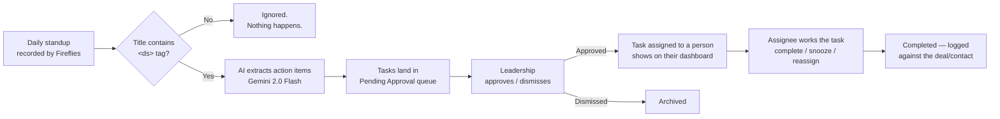
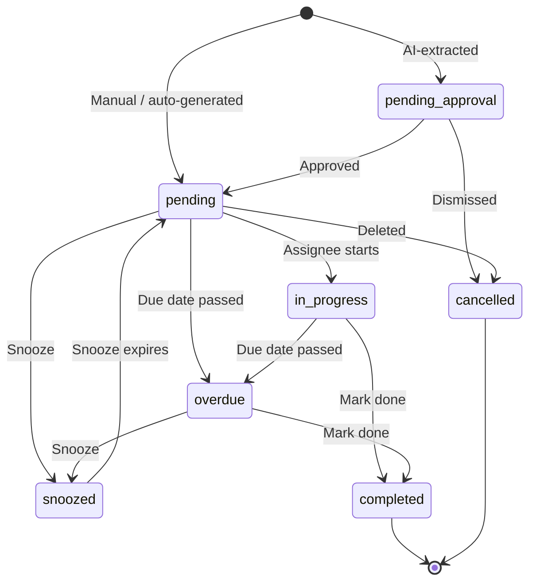

# Task System — Team Guide

_Audience: the whole Connect Market Nexus team. Last updated 2026-04-20._

> **Quick start.** Every weekday standup that has `<ds>` in its Fireflies title is transcribed, sent to an AI, and turned into a list of pending tasks. Leadership approves them; approved tasks land on each assignee's dashboard. You work from your dashboard at **`/admin/remarketing/daily-tasks`**.

This document is for humans using the system day-to-day. There is a deeper technical spec at `docs/AI_TASK_SYSTEM_SPEC_v3.1.md` — you don't need it unless you're building the system.

---

## 1. What the Task System is for

The Task System is the single, shared place where **every action item the team commits to** gets captured, assigned, tracked to completion, and escalated if it slips. The goal is simple:

> Nothing said in a standup should die in the transcript.

Before this system, action items lived in people's heads, meeting notes, DMs, and post-it notes. Things slipped. Now, the AI listens to the standup, drafts tasks from what people committed to, leadership approves them, and they show up on the right person's dashboard.

### The big picture



Everything else in this guide is a detail of one of those boxes.

---

## 2. The daily AI pipeline — how tasks get created

### 2.1 The `<ds>` tag rule _(most common source of confusion)_

A standup meeting is only processed if **the word `<ds>` appears in the Fireflies meeting title**. No tag, no tasks. This is by design — the team uses Fireflies for lots of meetings, and we don't want all of them extracted.

**Practical impact:**

- Name your standup events so the tag is in the title _before_ the meeting starts. Example: `<ds> Daily Ops Standup`.
- If you rename afterwards, the webhook has already fired — the cron fallback (see §2.4) will usually catch it within a few hours, but don't rely on that.
- Typos in the tag (`<sd>`, `<d.s>`, spaces) will not match. It has to be literally `<ds>`.

### 2.2 What the AI does

When a tagged standup ends, Fireflies POSTs to our webhook. We send the transcript to **Google Gemini 2.0 Flash** (via OpenRouter for rate limiting). The AI's job is to scan for sentences like:

- _"I'll send the NDA to Acme by Friday"_ → task: "Send NDA to Acme", assigned to the speaker, due Friday.
- _"Someone needs to call back the Miller Restoration buyer"_ → task: "Call back Miller Restoration buyer", unassigned.
- _"Let's schedule the management call for next week"_ → task: "Schedule management call", due next week.

For each extracted task the AI captures:

- **Title and description** — what to do.
- **Assignee** — matched from the speaker name to a team member via an alias table.
- **Deal/entity reference** — e.g. which deal or buyer this is about.
- **Evidence quote** — the exact sentence from the transcript that produced the task.
- **Confidence level** — high / medium / low.

All extracted tasks land with status **`pending_approval`**.

### 2.3 Approval

Extracted tasks don't reach anyone's dashboard until leadership reviews them. On the Daily Task Dashboard there's a **Pending Approval** section at the top showing:

- Each proposed task with its evidence quote (so you can see _why_ the AI drafted it).
- Confidence badge.
- One-click **Approve** or **Dismiss** per task, plus **Approve All** for bulk action.

The approver's job is fast: _Does this reflect what was actually committed? If yes, approve. If not, dismiss._

### 2.4 The safety net — cron polling

If a webhook fails or a standup's tag was added late, a scheduled job runs **four times a day** (12 PM ET, 5 PM ET, and DST equivalents) that looks back over the last 48 hours for any `<ds>`-tagged meetings we missed. In plain English: if your standup doesn't appear in the queue immediately, wait a few hours — it will almost certainly show up.

### 2.5 Fallback: Fireflies native action items

If the Gemini API is unavailable, the pipeline falls back to Fireflies' own built-in action items (less accurate, but better than nothing). You should not notice the difference day-to-day.

### 2.6 Pipeline diagram — detailed

```mermaid
sequenceDiagram
    participant F as Fireflies
    participant W as Webhook<br/>(process-standup)
    participant AI as extract-standup-tasks<br/>(Gemini 2.0 Flash)
    participant DB as Supabase
    participant UI as Dashboard

    F->>W: Transcript ready (title contains &lt;ds&gt;)
    W->>W: Check tag — skip if missing
    W->>AI: Send transcript + known deals + team aliases
    AI->>AI: Extract tasks, match speakers, tag deals
    AI->>DB: Insert tasks as pending_approval
    AI->>DB: Insert meeting record with extraction stats
    Note over DB,UI: Approver opens dashboard
    UI->>DB: Fetch pending_approval
    UI->>UI: Approver clicks Approve
    UI->>DB: status = pending, notify assignee (when wired)
```

---

## 3. Task lifecycle

### 3.1 Statuses



| Status             | Meaning                                                        |
| ------------------ | -------------------------------------------------------------- |
| `pending_approval` | AI drafted it; waiting on leadership review.                   |
| `pending`          | Approved (or created manually). Waiting to be worked.          |
| `in_progress`      | Assignee has started.                                          |
| `snoozed`          | Temporarily hidden. Wakes up automatically on the snooze date. |
| `overdue`          | Due date passed without completion.                            |
| `completed`        | Done. Logged to the linked deal/contact.                       |
| `cancelled`        | Dismissed or deleted.                                          |
| `listing_closed`   | Auto-cancelled because the associated listing closed.          |

### 3.2 How tasks get created (four paths)

1. **AI extraction from standup** — the primary path. §2 above.
2. **Manual creation** — anyone can click **+ Add Task** on the dashboard or on a deal page. These skip approval and land as `pending`.
3. **Auto-generated** — _partially implemented._ The schema supports auto-creation from call dispositions and deal-stage entry; see §6 for current state.
4. **Recurrence** — completing a task marked as recurring spawns the next instance automatically.

### 3.3 Assignment

- AI matches the speaker's name from the transcript to a team member using an **alias table**. If the person isn't in that table (or is new), the task comes through **unassigned** and the approver needs to assign it.
- Anyone with access can **reassign** a task from its action menu.

### 3.4 Actions you can take on a task

| Action       | What it does                                                                                                    |
| ------------ | --------------------------------------------------------------------------------------------------------------- |
| **Complete** | Marks done, logs to the deal timeline, notifies the task creator, and spawns the next recurrence if applicable. |
| **Snooze**   | Hides the task until a chosen date (presets: tomorrow, 3d, 1w, 2w, 1m).                                         |
| **Reassign** | Transfer to a different team member.                                                                            |
| **Edit**     | Change title, description, due date, priority, tags.                                                            |
| **Pin**      | Force a task to the top of its list regardless of priority score.                                               |
| **Comment**  | Add context; visible to anyone viewing the task.                                                                |
| **Delete**   | Cancels the task. Avoid for tasks already completed — they should stay in history.                              |

### 3.5 Overdue and escalation

A scheduled job marks tasks `overdue` once the due date passes. Escalation works in levels:

| Days overdue | Escalation level | Who gets notified _(see §6 — not all wired up yet)_ |
| ------------ | ---------------- | --------------------------------------------------- |
| 1+           | 1                | Assignee                                            |
| 3+           | 2                | Assignee's manager                                  |
| 7+           | 3                | Leadership                                          |

The job also wakes snoozed tasks whose snooze date has arrived.

---

## 4. Using the dashboard

**URL:** `/admin/remarketing/daily-tasks` (from the Admin sidebar → _Daily Tasks_).

### 4.1 The three main views

**My Tasks** _(default)_ — only tasks assigned to you. Grouped into:

- **Today / Overdue** — start here.
- **Upcoming** — due in the next few days.
- **Snoozed** — tasks you've deferred.
- **Completed** — history, toggled on/off.

**All Team Tasks** _(leadership)_ — everybody's tasks, grouped by person then by time. Use this to see workload and unblock people.

**Standups** — a list of meetings the AI has processed, with stats: how many tasks it extracted, average confidence, and a link to the Fireflies transcript. Use this to sanity-check that your standups are actually being processed.

### 4.2 Calendar view

Toggle in the top-right to see tasks laid out on a monthly calendar by due date. Useful for forward planning.

### 4.3 Filters

The filter bar lets you narrow by:

- **Entity type** (deal / listing / buyer / contact).
- **Specific meeting** (all tasks from a given standup).
- **Tags** (free-form labels).
- **Assignee** (in _All Team_ view).

### 4.4 Pending approval

Shown at the top of the dashboard **only if you have approver permissions** and there are tasks waiting. It displays each AI-drafted task with its evidence quote and confidence — approve, dismiss, or _Approve All_ in bulk.

### 4.5 Analytics

`/admin/remarketing/daily-tasks/analytics`. KPIs include total assigned, completion %, overdue count, average time to complete, a team leaderboard, breakdown by task type, meeting-quality metrics, and task volume trends over time.

---

## 5. How tasks connect to the rest of the system

Every task can link to a **deal**, **listing**, **buyer**, or **contact** (and optionally a _secondary_ entity — e.g. both a buyer and a contact when the task is about a specific person at a specific firm).

When you complete a task, we log a `task_completed` activity against its linked entity, so (in principle) it shows up on that entity's timeline. **See §6 — the unified timeline is not yet reliable.**

Tasks that originate from a standup also carry a `source_meeting_id` — you can always trace a task back to the exact meeting (and evidence quote) it came from.

---

## 6. Known limitations — read this before you get confused

Most of what older audit docs flagged has been fixed. What's left is a short list, honestly described.

| #     | Limitation                                                                                                                          | What it means for you                                                                                                            |
| ----- | ----------------------------------------------------------------------------------------------------------------------------------- | -------------------------------------------------------------------------------------------------------------------------------- |
| **1** | **No email notifications (by design, for now).** The `send-task-notification-email` function exists but isn't triggered.            | You need to open the dashboard — the system won't email you. Plan accordingly.                                                   |
| **2** | **Only `<ds>`-tagged standups are extracted.** Buyer calls, seller calls, management calls — not touched by the AI.                 | Create tasks from those meetings manually. Broadening extraction to other meeting types is a planned project, not a current one. |
| **3** | **No auto-completion when an NDA signs.** A "Send NDA" task doesn't auto-close when the NDA is actually signed via PandaDoc.        | Manually mark the task complete after you confirm the NDA is signed.                                                             |
| **4** | **No mobile-optimized view.** The dashboard is built for desktop.                                                                   | On phone, it works but cramped. Desktop-first for now.                                                                           |
| **5** | **Snooze has preset durations only.** Tomorrow, 3d, 1w, 2w, 1m — no custom date.                                                    | To defer to a specific date, edit the due date directly.                                                                         |
| **6** | **Pending-approval tasks can sit indefinitely.** No deadline forces the approver to act.                                            | If your approver goes on leave, nominate a backup — otherwise the queue just grows.                                              |
| **7** | **The `<ds>` tag is case-sensitive and strict.** `<DS>`, `<d-s>`, `< ds >` will not match.                                          | Make the tag part of your recurring calendar invite template.                                                                    |
| **8** | **Recurring tasks spawn only on completion, not on a schedule.** If you never complete the parent, the next instance never appears. | Don't leave the parent of a recurring series open indefinitely.                                                                  |

### What changed since the earlier audit doc

The audit `TASK_WORKFLOW_COMPREHENSIVE_AUDIT_2026-04-07.md` called out several items that are now actually working — verified directly against the code on 2026-04-20:

- ✅ **Deal activity timeline records task events.** Task create / complete / reassign write to `deal_activities` from the mutation hooks and via `log_deal_activity()` RPC.
- ✅ **In-app notifications fire on task approve, reassign, complete, and overdue escalations.** (Only email notifications remain disabled — see limitation #1.)
- ✅ **PhoneBurner call dispositions auto-create follow-up tasks.** E.g. disposition "Callback requested" → schedule_call task, priority high, due in 1 day.
- ✅ **Smartlead inbound "interested" email replies auto-create follow-up tasks.** Gated by AI sentiment classification.
- ✅ **HeyReach LinkedIn "interested" replies auto-create follow-up tasks.**
- ✅ **Task dependency UI wired.** `depends_on` is editable in Add/Edit Task dialogs, a dedicated Dependency View is available on deal pages, and blocked tasks show a **Blocked** badge.
- ✅ **Overdue check runs hourly** (`0 * * * *`) and escalates at 3 and 7 days overdue.
- ✅ **Recurring tasks spawn correctly** on completion, linked via `recurrence_parent_id`.

---

## 7. FAQ

**Q: Why didn't my meeting produce tasks?**
A: 95% of the time: the Fireflies title doesn't contain `<ds>`. Open the meeting in Fireflies, check the title. If the tag is there and no tasks appeared within ~6 hours, check the **Standups** tab of the dashboard — if the meeting appears there with `tasks_extracted = 0`, the AI heard the meeting but didn't find commitments. If the meeting isn't listed at all, the webhook didn't fire and the cron missed it; ping engineering.

**Q: Why do I have tasks I didn't expect?**
A: The AI extracted something from a standup where your name was heard (or a speaker alias matched you). Open the task — the **evidence quote** shows the exact sentence that produced it. If it's a genuine misinterpretation, reassign or delete; if it's edge-case noise (the AI heard "Tomos" in passing), tell the approver so they dismiss rather than approve next time.

**Q: I completed a task yesterday. Why is it still on my dashboard?**
A: Completed tasks are hidden by default. Toggle **Show completed** in the filter bar to see them.

**Q: Can I create a recurring task?**
A: Yes, the schema supports it — set the recurrence rule when creating. Note the gotcha in §6 item 12: the next instance only spawns when you complete the current one.

**Q: Who approves tasks?**
A: Leadership. If you're a line operator and an AI-extracted task is wrong, comment on it or flag the approver before they hit Approve All.

**Q: I need to add a task to a deal — where do I do it?**
A: Either from the Daily Task Dashboard (**+ Add Task**, then link to the deal), or from the deal page itself (**Tasks** tab → **+ Add Task**). They land in the same place.

**Q: Something is broken. Where do I report it?**
A: Check §6 first — it might be a known limitation. If it's genuinely new, include the meeting URL, approximate time, and what you expected vs. what happened.

---

## 8. Glossary / cheat sheet

| Term             | Meaning                                                                                             |
| ---------------- | --------------------------------------------------------------------------------------------------- |
| `<ds>` tag       | The literal string that must appear in a Fireflies meeting title to trigger task extraction.        |
| Standup          | A daily team meeting, recorded by Fireflies, that (when tagged) is the primary source of tasks.     |
| Approver         | Someone with permission to approve or dismiss AI-drafted tasks.                                     |
| Evidence quote   | The sentence from a transcript that the AI used to draft a task. Visible on each AI-extracted task. |
| Assignee         | The person responsible for completing a task.                                                       |
| Source meeting   | The standup a task came from. Tasks can always be traced back to one.                               |
| Snooze           | Hide a task until a future date; it wakes up automatically.                                         |
| Pin              | Force a task to the top of a list regardless of its priority score.                                 |
| Escalation level | 0–3, increases with days overdue; controls who gets notified (when notifications are wired).        |
| Entity link      | The deal / listing / buyer / contact a task is about.                                               |
| Recurrence       | A task that spawns a new copy of itself on completion.                                              |

---

## Where things live (for the curious)

| Thing                 | Location in repo                                                   |
| --------------------- | ------------------------------------------------------------------ |
| Dashboard UI          | `src/pages/admin/remarketing/DailyTaskDashboard.tsx`               |
| Route definition      | `src/App.tsx` line 525                                             |
| Task types            | `src/types/daily-tasks.ts`                                         |
| Webhook handler       | `supabase/functions/process-standup-webhook/index.ts`              |
| AI extraction         | `supabase/functions/extract-standup-tasks/index.ts`                |
| Cron fallback         | `supabase/functions/sync-standup-meetings/index.ts`                |
| Overdue checker       | `supabase/functions/check-overdue-tasks/index.ts`                  |
| Schema                | `supabase/migrations/20260227000000_ai_task_system_v31_schema.sql` |
| Deeper technical spec | `docs/AI_TASK_SYSTEM_SPEC_v3.1.md`                                 |
| Audit of gaps         | `TASK_WORKFLOW_COMPREHENSIVE_AUDIT_2026-04-07.md` _(repo root)_    |

---

_Questions, corrections, or confusion — flag it. This doc should reflect how the system actually behaves; if reality and this doc disagree, reality wins and the doc gets updated._
