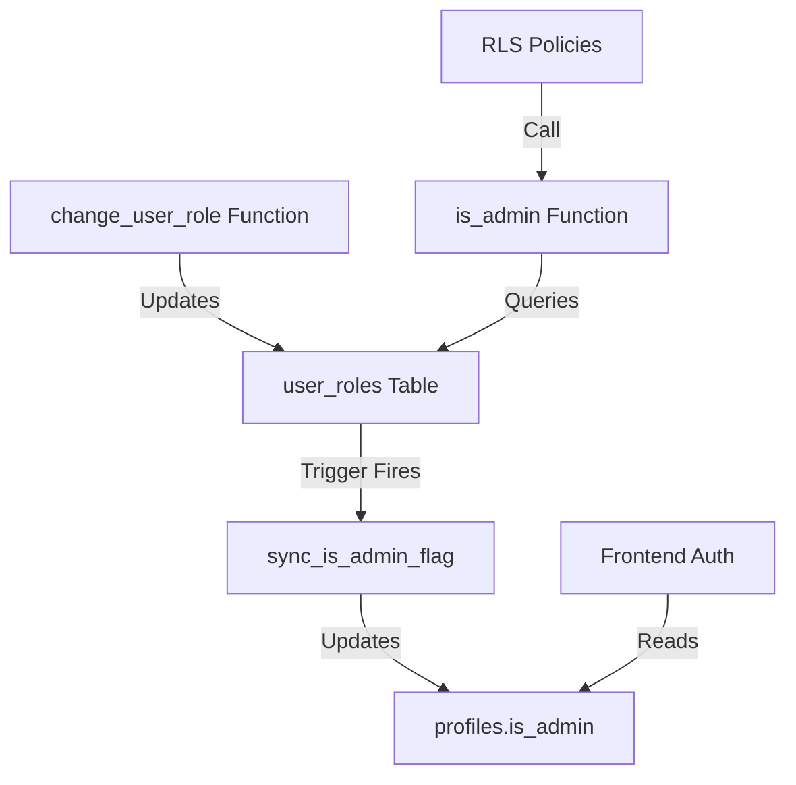

# 🔐 Permissions & Role System Documentation

## Overview

This application uses a **role-based access control (RBAC) system** with three roles:
- **Owner** - Full system access, can manage all roles and delete users
- **Admin** - Administrative access to manage users and content
- **User** - Standard user access

## Architecture

### Source of Truth: `user_roles` Table

The `user_roles` table is the **single source of truth** for all permissions:

```sql
CREATE TABLE public.user_roles (
  id uuid PRIMARY KEY,
  user_id uuid REFERENCES auth.users(id),
  role app_role NOT NULL,  -- 'owner' | 'admin' | 'user'
  assigned_by uuid,
  assigned_at timestamp,
  reason text,
  UNIQUE (user_id)  -- One role per user
);
```

### Auto-Sync Mechanism

The `is_admin` flag on the `profiles` table is **automatically synchronized** from `user_roles`:

1. **Database Trigger**: `sync_is_admin_on_role_change` 
   - Fires on INSERT/UPDATE/DELETE of `user_roles`
   - Updates `profiles.is_admin` automatically
   - Sets `is_admin = true` for 'owner' and 'admin' roles

2. **is_admin() Function**: 
   - Queries `user_roles` table directly
   - Used by 60+ RLS policies
   - Returns true for 'owner' or 'admin' roles

### Security Model



## Permission Hierarchy

```
Owner (Level 3)
  ├─ Can manage all roles (assign owner, admin, user)
  ├─ Can delete users
  ├─ Full access to all admin features
  └─ Cannot change own role
  
Admin (Level 2)
  ├─ Cannot manage roles
  ├─ Cannot delete users
  ├─ Can manage users and content
  └─ Cannot promote/demote other admins
  
User (Level 1)
  └─ Standard access to marketplace
```

## Frontend Integration

### Auth Context

```typescript
// src/hooks/use-nuclear-auth.ts
isAdmin: user?.is_admin === true
// ✅ Safe: This flag is auto-synced from user_roles via trigger
```

### Permission Hooks

```typescript
// src/hooks/permissions/usePermissions.ts
export const usePermissions = () => {
  const { user } = useAuth();
  
  // Fetches from user_roles table via RPC
  const { data: userRole } = useQuery({
    queryFn: () => supabase.rpc('get_user_role', { _user_id: user.id })
  });

  return {
    userRole,           // 'owner' | 'admin' | 'user'
    isOwner,            // userRole === 'owner'
    isAdmin,            // userRole === 'admin' || isOwner
    canManagePermissions, // isOwner (only owners can manage roles)
    checkPermission,    // Check if user has required role level
  };
};
```

### Protected Routes

```typescript
// src/components/ProtectedRoute.tsx
if (requireAdmin && user.is_admin !== true) {
  return <Navigate to="/unauthorized" />;
}
// ✅ Safe: is_admin flag is synced from user_roles
```

## Security Features

### ✅ **Implemented Protections**

1. **Server-Side Validation**: All role checks use SECURITY DEFINER functions
2. **RLS Policies**: 60+ policies protect database access
3. **Owner-Only Operations**: 
   - Role management restricted to owners
   - User deletion restricted to owners
   - Cannot change own role
4. **Auto-Sync**: is_admin flag cannot be manually manipulated (trigger-controlled)
5. **Audit Trail**: All role changes logged in `permission_audit_log`

### 🚫 **Security Rules**

- **DO NOT** manually update `profiles.is_admin` - use `change_user_role()` function
- **DO NOT** hardcode email addresses for permission checks
- **DO NOT** check permissions client-side only - always validate server-side
- **DO NOT** allow users to change their own roles

## Database Functions

### change_user_role()

```sql
-- Only owners can change roles
SELECT change_user_role(
  target_user_id := '<uuid>',
  new_role := 'admin',
  change_reason := 'Promoted for user management'
);
```

**Features:**
- Owner-only access
- Prevents self-role-change
- Auto-syncs is_admin flag (via trigger)
- Creates audit log entry

### get_user_role()

```sql
-- Returns user's role from user_roles table
SELECT get_user_role(_user_id := '<uuid>');
-- Returns: 'owner' | 'admin' | 'user'
```

### is_admin()

```sql
-- Used by RLS policies
SELECT is_admin(auth.uid());
-- Returns: true if user has 'owner' or 'admin' role
```

### is_owner()

```sql
-- Check if user is owner
SELECT is_owner(auth.uid());
-- Returns: true if user has 'owner' role
```

## UI Components

### RoleSelector

Location: `src/components/admin/permissions/RoleSelector.tsx`

```tsx
<RoleSelector 
  userId={user.id}
  currentRole={currentRole}
  userEmail={user.email}
  disabled={!canManagePermissions}
/>
```

**Features:**
- Owner role assignment restricted
- Confirmation dialog with reason field
- Shows role badges with descriptions
- Integrates with `useRoleManagement` hook

### RoleBadge

Location: `src/components/admin/permissions/RoleBadge.tsx`

```tsx
<RoleBadge role="admin" showTooltip={true} />
```

**Displays:**
- Color-coded badges (owner: amber, admin: primary, user: muted)
- Icons (Crown, Shield, User)
- Tooltip with role description

## Common Patterns

### Checking Permissions in Components

```typescript
const { isAdmin, isOwner, canManagePermissions } = usePermissions();

// Check if user can perform action
if (isOwner) {
  // Owner-only features (role management, user deletion)
}

if (isAdmin) {
  // Admin features (user management, content moderation)
}

if (canManagePermissions) {
  // Same as isOwner - for role management UI
}
```

### RLS Policy Pattern

```sql
-- Admin-only access
CREATE POLICY "Admins can manage X"
ON public.some_table
FOR ALL
TO authenticated
USING (is_admin(auth.uid()))
WITH CHECK (is_admin(auth.uid()));

-- Owner-only access
CREATE POLICY "Owners can manage X"
ON public.some_table
FOR ALL
TO authenticated
USING (is_owner(auth.uid()))
WITH CHECK (is_owner(auth.uid()));
```

## Migration History

### Initial Setup
- Created `user_roles` table with `app_role` enum
- Created RLS policies for owner-only management
- Created `change_user_role()`, `get_user_role()`, `is_owner()` functions

### Moderator Removal
- Removed 'moderator' from `app_role` enum
- Updated all existing moderator users to 'user' role
- Simplified to 3-role system

### Security Hardening
- Updated `is_admin()` to check `user_roles` table (source of truth)
- Created `sync_is_admin_flag()` trigger function
- Added trigger to auto-sync `profiles.is_admin`
- Restricted user deletion to owner-only
- Added database comments documenting the system

## Troubleshooting

### User shows wrong role in UI

**Check:**
1. Query `user_roles` table for user's actual role
2. Verify `profiles.is_admin` matches role (should be auto-synced)
3. Check browser console for auth errors

**Fix:**
```sql
-- Manually sync if needed (trigger should handle this)
UPDATE profiles SET is_admin = EXISTS (
  SELECT 1 FROM user_roles 
  WHERE user_id = profiles.id 
  AND role IN ('admin', 'owner')
);
```

### Permission denied errors

**Common causes:**
1. User doesn't have required role in `user_roles`
2. RLS policy blocking access
3. Frontend checking wrong permission

**Debug:**
```sql
-- Check user's role
SELECT * FROM user_roles WHERE user_id = '<uuid>';

-- Check if is_admin() returns correct value
SELECT is_admin('<uuid>');

-- Check if is_owner() returns correct value  
SELECT is_owner('<uuid>');
```

### Cannot assign owner role

**Expected behavior:** Owner role can only be assigned by existing owners. If you need to create the first owner, you must:

1. Use SQL directly in Supabase dashboard
2. Insert into `user_roles` table
3. Trigger will auto-sync `is_admin` flag

```sql
INSERT INTO user_roles (user_id, role, assigned_by, reason)
VALUES (
  '<new-owner-uuid>',
  'owner',
  auth.uid(),  -- Your current owner account
  'Creating new owner account'
);
```

## Best Practices

### ✅ DO

- Use `usePermissions()` hook for permission checks
- Use `change_user_role()` function to change roles
- Check permissions on both frontend AND backend
- Log reason when changing roles
- Use semantic role checks (`isOwner`, `isAdmin`) not hard coded roles

### ❌ DON'T

- Don't manually update `profiles.is_admin`
- Don't hardcode email addresses for permission checks
- Don't skip permission checks assuming UI hides features
- Don't allow users to change their own roles
- Don't check permissions client-side only

## Security Checklist

- [x] Roles stored in separate `user_roles` table
- [x] RLS policies on `user_roles` (owner-only)
- [x] Server-side validation with SECURITY DEFINER functions
- [x] Auto-sync mechanism for backward compatibility
- [x] Audit trail for all role changes
- [x] Owner role restricted to specific operations
- [x] Self-role-change prevention
- [x] User deletion restricted to owners
- [x] Frontend integrated with permission system

---

**Last Updated:** 2025-10-29  
**System Status:** ✅ Production Ready
